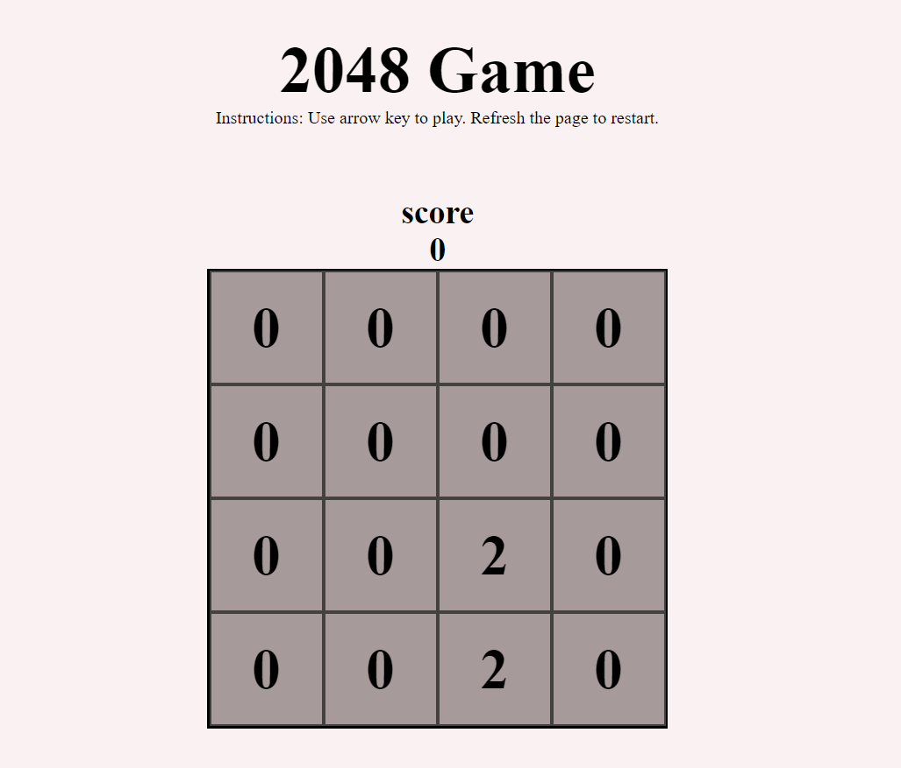

# 🎯 2048 Game

  

  <b>A fun and addictive 2048 puzzle game built using HTML, CSS, and JavaScript!</b>

---
## 🧩 Live Demo  
👉 [Play Now](https://vineela-16.github.io/2048-game/)  
*(https://vineela-16.github.io/2048Game/)*

---
## 🕹️ How to Play
- Use your **arrow keys** ⬆️⬇️⬅️➡️ to move the tiles.  
- When two tiles with the same number touch, they **merge** into one.  
- Keep going until you reach the **2048 tile** 🏆  
- Game over if there are no more moves left!

---

## ✨ Features
✅ Smooth tile animations  
✅ Score tracker  
✅ Restart button  
✅ Simple, responsive design  
✅ Built entirely with **vanilla JavaScript** — no frameworks!

---

## 💻 Technologies Used
| Technology | Description |
|-------------|-------------|
| 🧱 HTML5 | Structure of the game |
| 🎨 CSS3 | Game layout and design |
| ⚙️ JavaScript (ES6) | Game logic and interactions |

---

## 📁 Project Structure

│

├── index.html # Main HTML file

├── style.css # Game styling

├── script.js # Game logic

└── screenshot.PNG # Preview of the game
